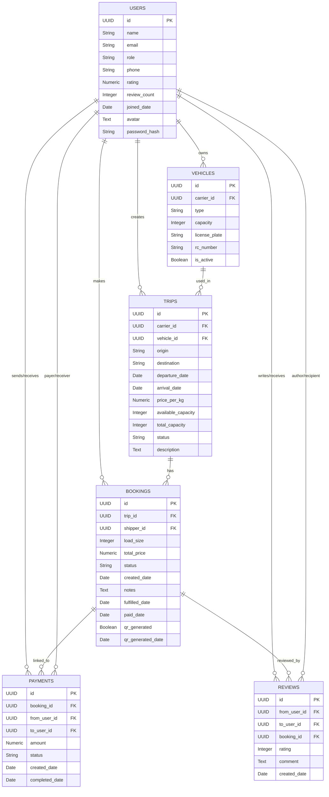
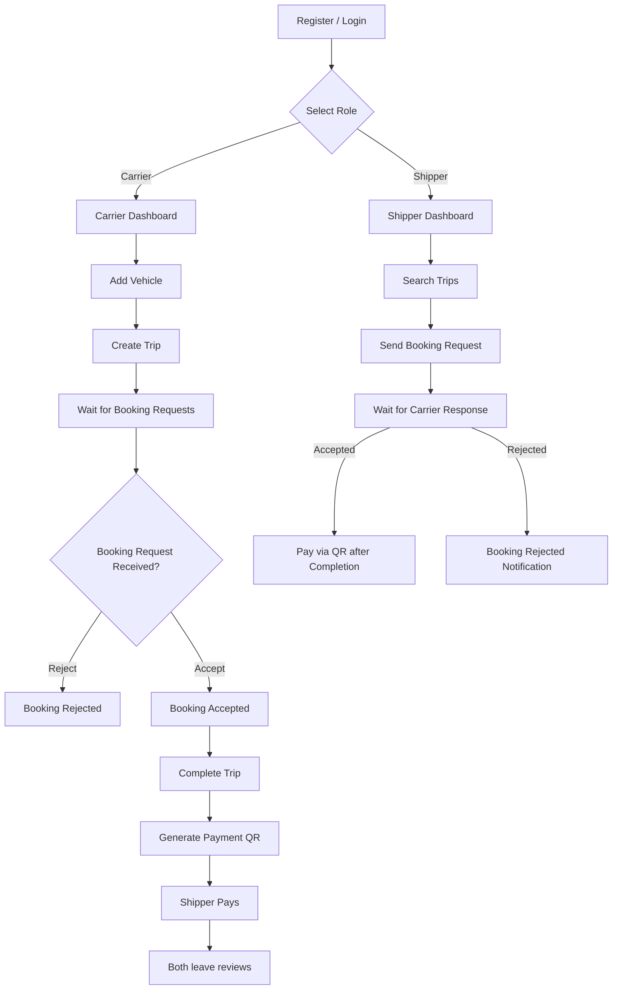
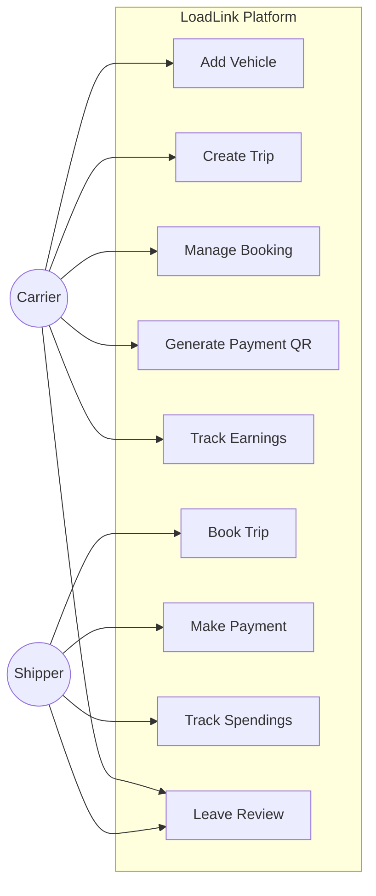

# LoadLink

A **web application for carriers and shippers** where truck drivers (carriers) can create trips and manage vehicles, while shippers can book trips, make payments, and both can review each other.

The platform ensures transparency, secure payments, and real-time booking management.

---


## Table of Contents
- [Overview](#overview)
- [Features](#features)
- [Tech Stack](#tech-stack)
- [ER Diagram](#er-diagram)
- [Flowchart](#flowchart)
- [Setup & Installation](#setup--installation)
- [API Endpoints](#api-endpoints)
- [Postman Collection](#postman-collection)
- [Usage](#usage)
- [License](#license)


---


## Overview

LoadLink simplifies logistics by connecting shippers with carriers through an intuitive web app. Key workflows include:

- Role-based registration: **Shipper** or **Carrier**
- Carrier can add vehicles and create trips
- Shippers can search trips and request bookings
- Carriers accept/reject bookings
- Payment via QR code after trip completion
- Ratings and reviews for both carriers and shippers

---

## Features

### Shipper
- Register & login
- View dashboard
- Search trips by origin, destination, date, and price
- Create booking requests
- Pay via generated QR codes
- Review carriers after trip completion

### Carrier
- Register & login
- Add and manage vehicles
- Create trips
- Accept or reject bookings
- Mark trip as complete
- Generate payment QR code
- Review shippers after trip completion

### Common
- Role-based access control
- Ratings & reviews system
- Notifications for booking status

---

## Tech Stack

| Layer | Technology |
|-------|------------|
| Frontend | Next.js, TypeScript, Tailwind CSS, Shadcn UI, Axios |
| Backend | Python, FastAPI, SQLAlchemy |
| Database | PostgreSQL |
| API Testing | Postman |
| Deployment | Azure |

---


## ⚙️ Installation & Setup

```bash
# Clone repository
git clone https://github.com/your-username/loadlink.git
cd loadlink

# Backend setup
cd LoadLink-BE
python -m venv venv
source venv/bin/activate   # On Windows: venv\Scripts\activate
pip install -r requirements.txt
uvicorn app.main:app --reload

# Frontend setup
cd LoadLink-FE
npm install
npm run dev
```

---

## ER Diagram



---

##  Flowchart 



---

## 🎭 Use Case Diagram



---

## 📑 Database Dictionary

| Table        | Column              | Type         | Description                                        |
| ------------ | ------------------- | ------------ | -------------------------------------------------- |
| **users**    | id                  | UUID (PK)    | Unique user ID                                     |
|              | name                | String(100)  | Full name                                          |
|              | email               | String(150)  | Unique email                                       |
|              | role                | String(20)   | `shipper` or `carrier`                             |
|              | phone               | String(20)   | Contact number                                     |
|              | rating              | Numeric(2,1) | Average rating                                     |
|              | review\_count       | Integer      | Number of reviews                                  |
|              | joined\_date        | Date         | Account creation date                              |
|              | avatar              | Text         | Profile image                                      |
|              | password\_hash      | String(255)  | Secure hashed password                             |
| **vehicles** | id                  | UUID (PK)    | Vehicle ID                                         |
|              | carrier\_id         | UUID (FK)    | Owner (carrier)                                    |
|              | type                | String(20)   | Truck, van, etc.                                   |
|              | capacity            | Integer      | Load capacity                                      |
|              | license\_plate      | String(20)   | Unique                                             |
|              | rc\_number          | String(50)   | Unique                                             |
|              | is\_active          | Boolean      | Vehicle status                                     |
| **trips**    | id                  | UUID (PK)    | Trip ID                                            |
|              | carrier\_id         | UUID (FK)    | Trip owner                                         |
|              | vehicle\_id         | UUID (FK)    | Assigned vehicle                                   |
|              | origin              | String(255)  | Start point                                        |
|              | destination         | String(255)  | End point                                          |
|              | departure\_date     | Date         | Departure                                          |
|              | arrival\_date       | Date         | Arrival                                            |
|              | price\_per\_kg      | Numeric      | Price                                              |
|              | available\_capacity | Integer      | Remaining load capacity                            |
|              | total\_capacity     | Integer      | Full capacity                                      |
|              | status              | String(20)   | active/completed/cancelled                         |
|              | description         | Text         | Trip details                                       |
| **bookings** | id                  | UUID (PK)    | Booking ID                                         |
|              | trip\_id            | UUID (FK)    | Related trip                                       |
|              | shipper\_id         | UUID (FK)    | Shipper                                            |
|              | load\_size          | Integer      | Size booked                                        |
|              | total\_price        | Numeric      | Price                                              |
|              | status              | String(20)   | pending/accepted/rejected/completed/fulfilled/paid |
|              | created\_date       | Date         | Booking creation                                   |
|              | fulfilled\_date     | Date         | Marked fulfilled                                   |
|              | paid\_date          | Date         | Paid date                                          |
|              | qr\_generated       | Boolean      | QR issued?                                         |
|              | qr\_generated\_date | Date         | When QR was generated                              |
| **payments** | id                  | UUID (PK)    | Payment ID                                         |
|              | booking\_id         | UUID (FK)    | Related booking                                    |
|              | from\_user\_id      | UUID (FK)    | Payer                                              |
|              | to\_user\_id        | UUID (FK)    | Receiver                                           |
|              | amount              | Numeric      | Amount paid                                        |
|              | status              | String(20)   | pending/completed/failed                           |
|              | created\_date       | Date         | Initiated                                          |
|              | completed\_date     | Date         | Completed                                          |
| **reviews**  | id                  | UUID (PK)    | Review ID                                          |
|              | from\_user\_id      | UUID (FK)    | Reviewer                                           |
|              | to\_user\_id        | UUID (FK)    | Reviewee                                           |
|              | booking\_id         | UUID (FK)    | Related booking                                    |
|              | rating              | Integer      | 1–5                                                |
|              | comment             | Text         | Feedback                                           |
|              | created\_date       | Date         | Written on                                         |

---

## API Endpoints

**Auth**

* `POST /auth/register` – Register as shipper or carrier
* `POST /auth/login` – Login and receive access token

**User**

* `GET /users/me` – Get current user details
* `GET /users/{id}` – Get user by ID

**Vehicle (Carrier only)**

* `POST /vehicles` – Add a new vehicle
* `GET /vehicles` – Get all vehicles
* `PUT /vehicles/{id}` – Update vehicle

**Trip (Carrier only)**

* `POST /trips` – Create a trip
* `GET /trips/my` – Get all trips for carrier
* `GET /trips/all` – Get all active trips
* `PUT /trips/{id}` – Update a trip

**Booking (Shipper)**

* `POST /bookings` – Create a booking
* `GET /bookings` – Get all bookings for shipper
* `PUT /bookings/{id}` – Update booking
* `DELETE /bookings/{id}` – Delete booking

**Payment & Review**

* Payment and review endpoints (under development)

---

## Postman Collection

A Postman collection is provided to quickly test all API endpoints.

### Import Collection

1. Download the collection JSON: [LoadLink.postman\_collection.json]([./postman/LoadLink.postman_collection.json](https://.postman.co/workspace/My-Workspace~5ffc3b87-d7b0-43d2-8a5f-6fcba95fbe03/collection/38528958-401b3b4b-5f83-4902-87c1-9dd1ac81e52d?action=share&creator=38528958))
2. Open Postman → Click **Import** → Select JSON → **Open**
3. The collection includes grouped endpoints:

   * Auth
   * User
   * Vehicle
   * Trip
   * Booking
   * Payment & Review

### Usage

* Set **environment variable `Baseurl`** to your backend URL (`http://127.0.0.1:8000`)
* Authenticate using the **Bearer token** from login for protected routes

---

## License

MIT License © 2025 LoadLink


