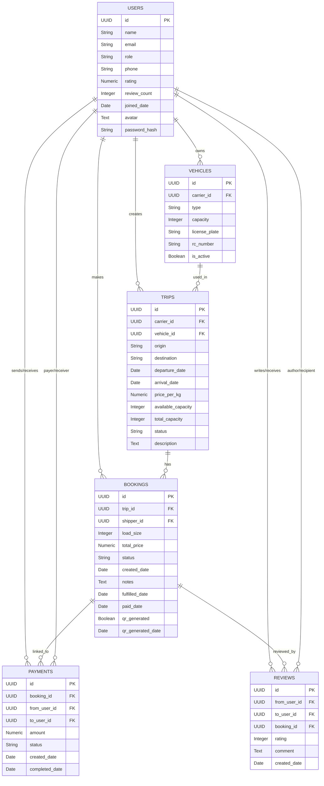
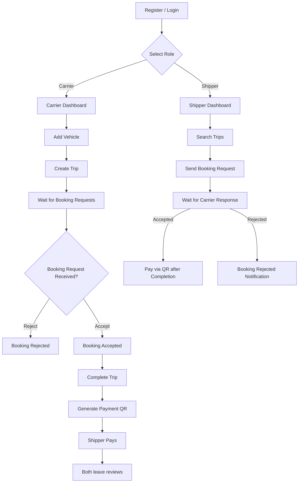
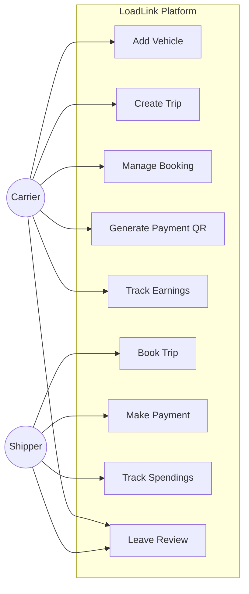

Perfect 🚛 thanks for the detailed models and feature description! I’ll generate a **comprehensive README.md** for your **LoadLink** project. It will include:

* 📌 Project overview & scope
* ⚙️ Tech stack
* 🗂 Features (for carriers & shippers)
* 🛠️ Installation & setup
* 📊 ER diagram (Mermaid)
* 🔄 Flowchart (Mermaid)
* 🎭 Use case diagram (Mermaid)
* 📑 Database dictionary

Here’s a production-ready draft you can drop directly into your repo 👇

---

# LoadLink

A **web application for carriers and shippers** where truck drivers (carriers) can create trips and manage vehicles, while shippers can book trips, make payments, and both can review each other.

The platform ensures transparency, secure payments, and real-time booking management.

---

## 🚀 Tech Stack

**Frontend**

* Next.js (TypeScript)
* Shadcn UI
* Tailwind CSS
* Axios

**Backend**

* FastAPI (Python)
* SQLAlchemy ORM
* PostgreSQL

---

## ✨ Features

### Carrier

* Add/manage vehicles
* Create and manage trips (origin, destination, pricing, availability)
* Accept or reject bookings
* Mark trips as fulfilled
* Generate **payment QR** upon completion
* Track **earnings**
* Write & receive reviews

### Shipper

* Browse and search trips
* Book trips with custom load size
* Pay securely via QR code after fulfillment
* Track **spending history**
* Write & receive reviews

---

## ⚙️ Installation & Setup

```bash
# Clone repository
git clone https://github.com/your-username/loadlink.git
cd loadlink

# Backend setup
cd LoadLink-BE
python -m venv venv
source venv/bin/activate   # On Windows: venv\Scripts\activate
pip install -r requirements.txt
uvicorn app.main:app --reload

# Frontend setup
cd LoadLink-FE
npm install
npm run dev
```

---

## 🗂 ER Diagram



---

## 🔄 Flowchart (Booking Process)



---

## 🎭 Use Case Diagram



---

## 📑 Database Dictionary

| Table        | Column              | Type         | Description                                        |
| ------------ | ------------------- | ------------ | -------------------------------------------------- |
| **users**    | id                  | UUID (PK)    | Unique user ID                                     |
|              | name                | String(100)  | Full name                                          |
|              | email               | String(150)  | Unique email                                       |
|              | role                | String(20)   | `shipper` or `carrier`                             |
|              | phone               | String(20)   | Contact number                                     |
|              | rating              | Numeric(2,1) | Average rating                                     |
|              | review\_count       | Integer      | Number of reviews                                  |
|              | joined\_date        | Date         | Account creation date                              |
|              | avatar              | Text         | Profile image                                      |
|              | password\_hash      | String(255)  | Secure hashed password                             |
| **vehicles** | id                  | UUID (PK)    | Vehicle ID                                         |
|              | carrier\_id         | UUID (FK)    | Owner (carrier)                                    |
|              | type                | String(20)   | Truck, van, etc.                                   |
|              | capacity            | Integer      | Load capacity                                      |
|              | license\_plate      | String(20)   | Unique                                             |
|              | rc\_number          | String(50)   | Unique                                             |
|              | is\_active          | Boolean      | Vehicle status                                     |
| **trips**    | id                  | UUID (PK)    | Trip ID                                            |
|              | carrier\_id         | UUID (FK)    | Trip owner                                         |
|              | vehicle\_id         | UUID (FK)    | Assigned vehicle                                   |
|              | origin              | String(255)  | Start point                                        |
|              | destination         | String(255)  | End point                                          |
|              | departure\_date     | Date         | Departure                                          |
|              | arrival\_date       | Date         | Arrival                                            |
|              | price\_per\_kg      | Numeric      | Price                                              |
|              | available\_capacity | Integer      | Remaining load capacity                            |
|              | total\_capacity     | Integer      | Full capacity                                      |
|              | status              | String(20)   | active/completed/cancelled                         |
|              | description         | Text         | Trip details                                       |
| **bookings** | id                  | UUID (PK)    | Booking ID                                         |
|              | trip\_id            | UUID (FK)    | Related trip                                       |
|              | shipper\_id         | UUID (FK)    | Shipper                                            |
|              | load\_size          | Integer      | Size booked                                        |
|              | total\_price        | Numeric      | Price                                              |
|              | status              | String(20)   | pending/accepted/rejected/completed/fulfilled/paid |
|              | created\_date       | Date         | Booking creation                                   |
|              | fulfilled\_date     | Date         | Marked fulfilled                                   |
|              | paid\_date          | Date         | Paid date                                          |
|              | qr\_generated       | Boolean      | QR issued?                                         |
|              | qr\_generated\_date | Date         | When QR was generated                              |
| **payments** | id                  | UUID (PK)    | Payment ID                                         |
|              | booking\_id         | UUID (FK)    | Related booking                                    |
|              | from\_user\_id      | UUID (FK)    | Payer                                              |
|              | to\_user\_id        | UUID (FK)    | Receiver                                           |
|              | amount              | Numeric      | Amount paid                                        |
|              | status              | String(20)   | pending/completed/failed                           |
|              | created\_date       | Date         | Initiated                                          |
|              | completed\_date     | Date         | Completed                                          |
| **reviews**  | id                  | UUID (PK)    | Review ID                                          |
|              | from\_user\_id      | UUID (FK)    | Reviewer                                           |
|              | to\_user\_id        | UUID (FK)    | Reviewee                                           |
|              | booking\_id         | UUID (FK)    | Related booking                                    |
|              | rating              | Integer      | 1–5                                                |
|              | comment             | Text         | Feedback                                           |
|              | created\_date       | Date         | Written on                                         |

---

✅ This README is **GitHub-ready** — all Mermaid diagrams are compatible.

Would you like me to also **generate PDF/Docx documentation** (with diagrams auto-rendered as images) so you can submit it for evaluation?
